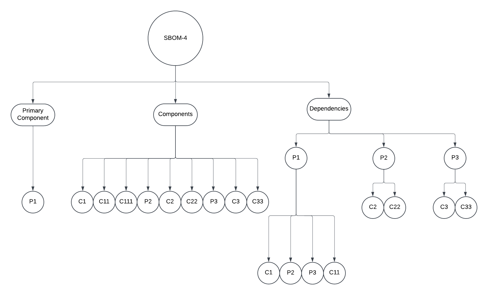

# How Assemble Command with `--primaryCompFile` works ?

The `assemble` command in the sbomasm tool enables combining multiple SBOMs (Software Bill of Materials) into a single, unified SBOM. With the addition of the `--primaryCompFile` flag, users can specify a base SBOM that serves as the foundation for the final assembled SBOM. This feature allows for flexible and configurable assembly strategies tailored to specific use cases, such as hierarchical, flat, or assembly merges.

- There are 3 ways of Assembling SBOMs that sbomasm tool support:
  - Hierarchical merge
  - Flat Merge
  - Assemble Merge

When using the flag `--primaryCompFile`, it works bit different. We will how it works for each merge types:

## How PrimaryCompFile Works for Hierarchical Merge

Our new feature introduces the ability to handle a `primaryCompFile` as a flag in the **sbomasm assemble** command. This file serves as the base for generating the final output SBOM specifically during the **hierarchical merge**. The feature ensures the following:

1. **Primary Component of the Final SBOM**:
   - The primary component of the `primaryCompFile` is directly used as the primary component of the final SBOM.

2. **Components of the Final SBOM**:
   - All components from the `primaryCompFile` are included in the final SBOM **in a flat manner**.

3. **Dependencies of the Final SBOM**:
   - All dependencies of the `primaryCompFile` are preserved and assigned to the primary component of the final SBOM.

4. **Handling Remaining Input SBOMs**:
   - All input SBOMs are added as **hierarchical components** under their respective primary components.
   - The primary components of these input SBOMs are:
     - Treated as individual components of the final SBOM.
     - Added as dependencies of the final SBOM's primary component.

## How the PrimaryCompFile works in the Flat merge

When the `primaryCompFile` is provided for the **flat merge**, the final SBOM is generated as follows:

1. **Primary Component of the Final SBOM**:
   - The primary component of the `primaryCompFile` is directly used as the primary component of the final SBOM.

2. **Components of the Final SBOM**:
   - All components from the `primaryCompFile` are included in the final SBOM **in a flat manner**.

3. **Dependencies of the Final SBOM**:
   - All dependencies from the `primaryCompFile` are preserved and assigned to the primary component of the final SBOM.

4. **Handling Input SBOMs**:
   - All components from the input SBOMs are added to the final SBOM **in a flat manner**.
   - The primary components of the input SBOMs are also added to the final SBOM **as flat components**.

5. **Input SBOMs' Primary Component Dependencies**:
   - The primary components of the input SBOMs are added as dependencies of the final SBOM's primary component.

## How the PrimaryCompFile works in the Assembly merge

When the `primaryCompFile` is provided for the **assembly merge**, the final SBOM is generated as follows:

1. **Primary Component of the Final SBOM**:
   - Unlike hierarchical and flat merges, the primary components of input SBOMs (e.g., P2, P3) are **nested as components** under the primary component of the final SBOM (P1).

2. **Components of the Final SBOM**:
   - All components from the `primaryCompFile` are included in the final SBOM **in a flat manner**.

3. **Dependencies of the Final SBOM**:
   - All dependencies of the `primaryCompFile` are preserved and assigned to the primary component of the final SBOM.

4. **Handling Input SBOMs**:
   - **Primary Components of Input SBOMs**:
     - The primary components of the input SBOMs are added as **components of the primary component of the final SBOM**. (Unlike flat and hierarchical merges, where they were placed in the `components` section.)
   - **Components of Input SBOMs**:
     - The components of the input SBOMs are added to the final SBOM **in a flat manner**.

5. **Input SBOMs' Primary Component Dependencies**:
   - The primary components of the input SBOMs are **not considered as dependencies** of the final SBOM's primary component because they are treated as its components.

### Example:

Consider this Example:

| **SBOM** | **Primary Component** | **Components**       | **Dependencies**   |
|----------|------------------------|----------------------|--------------------|
| SBOM1    | P1                    | C1, C11, C111       | P1 → C1, C11       |
| SBOM2    | P2                    | C2, C22             | P2 → C2, C22       |
| SBOM3    | P3                    | C3, C33             | P3 → C3, C33       |

Now we will see how final SBOM or final assembled SBOM for all 3 merge types looks like:

### Hierarchical Merge

**Final Assembled SBOM (`SBOM4`)**:

- **Primary Component**: `P1` (from `SBOM1`)
- **Components**: `C1`, `C11`, `C111`, `P2`, `P3`
  - **Where**:
  - `P2` contains `C2`, `C22`
  - `P3` contains `C3`, `C33`
- **Dependencies**:
- `P1` depends on `C1`, `C11`, `P2`, and `P3`.
- `P2` depends on `C2` and `C22`.
- `P3` depends on `C3` and `C33`.

### Flat Merge

**Final Assembled SBOM (`SBOM4`)**:

- **Primary Component**: `P1` (from `SBOM1`)
- **Components**: `C1`, `C11`, `C111`, `P2`, `P3`, `C2`, `C22`, `C3`, `C33`
- **Dependencies**:
- `P1` depends on `C1`, `C11`, `P2`, and `P3`.
- `P2` depends on `C2` and `C22`.
- `P3` depends on `C3` and `C33`.

### Assembly Merge

**Final Assembled SBOM (`SBOM4`)**:

- **Primary Component**: `P1` (from `SBOM1`)
  - And it contains components as `P2`, `P3`,
- **Components**: `C1`, `C11`, `C111`, `C2`, `C22`, `C3`, `C33`
- **Dependencies**:
- `P1` depends on `C1` and `C11`
- `P2` depends on `C2` and `C22`.
- `P3` depends on `C3` and `C33`.

### Table: Hierarchical Vs Flat Vs Assembly

| **Feature**            | **Hierarchical Merge**                             | **Flat Merge**                             | **Assembly Merge**                            |
|-------------------------|---------------------------------------------------|-------------------------------------------|-----------------------------------------------|
| **Primary Component**   | From `primaryCompFile`                            | From `primaryCompFile`                    | From `primaryCompFile`                        |
| **Components**          | components from `primaryCompFile` in flat manner + hierarchy from input SBOMs | components from `primaryCompFile` + all input SBOMs components + Primary Comp of Input SBOMs , in flat manner         | components from `primaryCompFile` +  all input SBOMs components, in flat manner |
| **Dependencies**        | Input SBOMs' primary components becomes dependencies of primary comp of `primaryCompFile` + other input SBOMs with their dependencies  | same as Hierarchical dependencies | Input SBOMs' primary components **are not dependencies** +  other input SBOMs with their dependencies |

---
